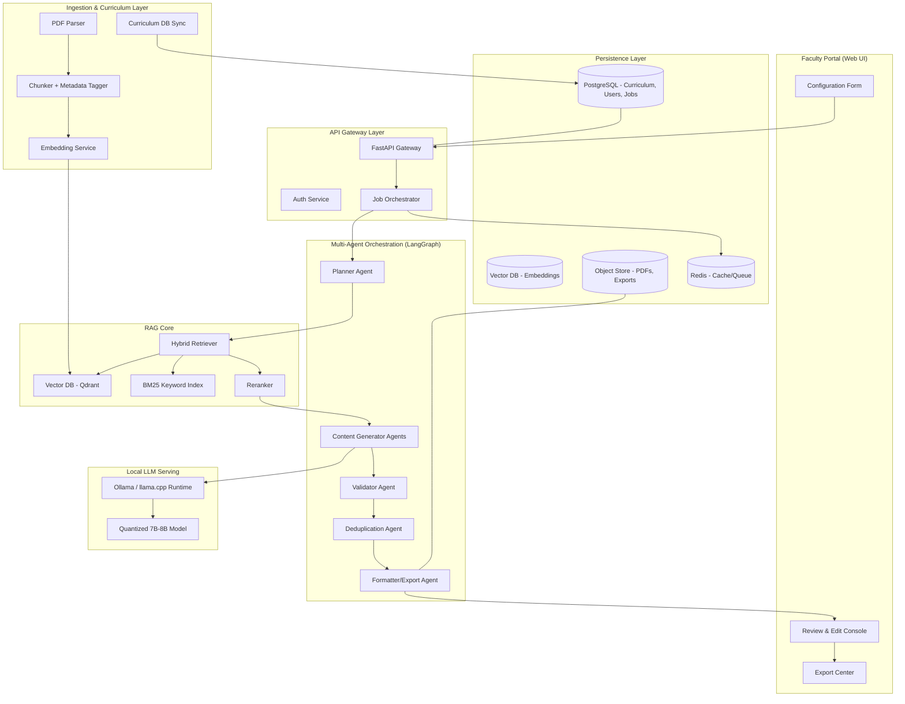
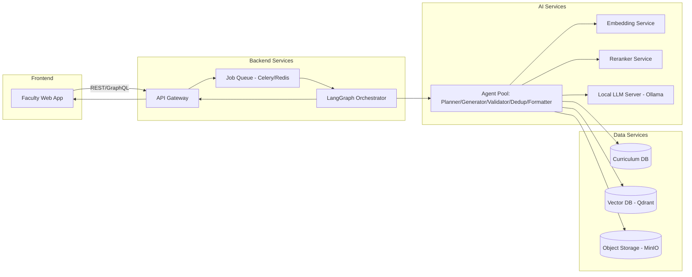
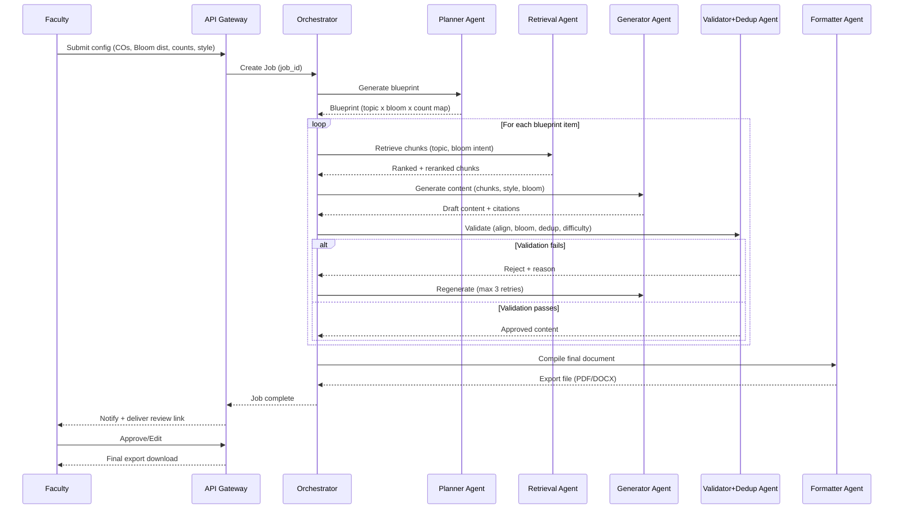
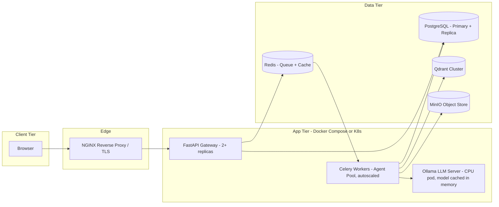

# AI-Powered Academic Content, Assessment & Question Generation System
### Production Architecture Documentation (RAG + Multi-Agent, CPU-Efficient, Open-Source)

---

## 1. End-to-End Workflow

```
Faculty Input (COs, Units, Bloom levels, difficulty, counts, style)
        ↓
Document Ingestion (Textbooks/PDFs → Chunked & Embedded)
        ↓
Retrieval (Hybrid: Vector + Keyword, filtered by Unit/Topic/CO)
        ↓
Planning Agent (builds a content blueprint: Bloom distribution, question counts, topic coverage map)
        ↓
Generation Agents (per content type: Notes, MCQs, Assignments, Activities, Discussion Qs)
        ↓
Validation Pipeline (syllabus alignment, Bloom tagging, duplicate check, difficulty check)
        ↓
Human-in-the-loop Review (optional faculty approval/edit)
        ↓
Export (PDF / DOCX / Question Bank / LMS-compatible JSON)
```

Each stage is a decoupled service communicating over an internal message bus/API, so any stage can be scaled, replaced, or retried independently.

---

## 2. High-Level Architecture



---

## 3. Multi-Agent Architecture (Agent Responsibilities)

| Agent | Responsibility |
|---|---|
| **Planner Agent** | Reads faculty config + CO/Unit mapping, builds a structured content blueprint (topic-wise Bloom distribution, question counts per level, pedagogy tags). Acts as the "task graph" generator for downstream agents. |
| **Retrieval Agent** | Executes hybrid retrieval (vector + BM25) scoped to selected Units/Topics/COs, passes ranked chunks to generation agents with source metadata for citation. |
| **Content Generator Agent** | Specialized sub-agents (Notes Agent, MCQ Agent, Assignment Agent, Activity Agent, Discussion Agent) each with type-specific prompt templates and output schemas. |
| **Bloom Alignment Agent** | Tags each generated item with its actual Bloom level (via classifier or LLM self-tagging) and reconciles against the planned distribution, triggering regeneration if mismatched. |
| **Deduplication Agent** | Computes semantic similarity (embedding cosine) across generated items and against historical question bank to reject/rewrite near-duplicates. |
| **Validator Agent** | Runs syllabus-alignment check (does content map to a real CO/Topic), factual grounding check (citation traceable to retrieved chunk), and difficulty consistency check. |
| **Formatter/Export Agent** | Converts validated JSON content into DOCX/PDF/LMS-ready formats, applies institutional templates. |
| **Orchestrator (Supervisor)** | LangGraph state machine coordinating agent handoffs, retries, and human-in-the-loop checkpoints. |

Agents are stateless workers reading/writing to a shared job-state object (in Redis/Postgres), enabling horizontal scaling and independent failure recovery.

---

## 4. RAG Pipeline

1. **Ingestion**: PDF → text extraction (PyMuPDF) → semantic chunking (500–800 tokens, overlap 100) → metadata tagging (Unit, Topic, Page, Book, CO mapping via rule-based + LLM classifier).
2. **Embedding**: Chunks embedded using `BAAI/bge-small-en-v1.5` (CPU-efficient, strong MTEB score) → stored in Qdrant with metadata filters.
3. **Retrieval**: Query built from Planner blueprint (Topic + Bloom intent + keywords) → hybrid search (dense + BM25 via Qdrant's sparse-dense fusion or Reciprocal Rank Fusion).
4. **Reranking**: Top-20 candidates reranked using `BAAI/bge-reranker-base` (cross-encoder, CPU-friendly) → top-5 passed to generator.
5. **Grounded Generation**: LLM prompted with retrieved chunks + citation IDs, instructed to only use provided context (reduces hallucination, enables traceability).
6. **Post-Retrieval Caching**: Frequently retrieved Topic-Bloom combinations cached in Redis to cut latency on repeated generation requests.

---

## 5. Data Flow

```
[Faculty Config JSON] 
   → Planner Agent → [Blueprint: {unit, topic, bloom_level, count, style}]
        → Retrieval Agent → [Ranked Chunks + Metadata]
             → Generator Agent → [Draft Content JSON + Source Refs]
                  → Bloom Agent → [Bloom-tagged Content]
                       → Dedup Agent → [Filtered Unique Content]
                            → Validator Agent → [Approved/Flagged Content]
                                 → Formatter Agent → [DOCX/PDF/JSON Export]
                                      → Faculty Review UI → [Final Approved Set]
```

All intermediate artifacts are persisted as versioned JSON in Postgres (JSONB) for auditability and regeneration without re-running the full pipeline.

---

## 6. Mermaid Component Diagram



---

## 7. Mermaid Sequence Diagram



---

## 8. Database Schema

```sql
-- Curriculum Structure
CREATE TABLE courses (
    course_id UUID PRIMARY KEY,
    course_name TEXT,
    course_code TEXT,
    department TEXT
);

CREATE TABLE course_outcomes (
    co_id UUID PRIMARY KEY,
    course_id UUID REFERENCES courses(course_id),
    co_code TEXT,          -- e.g. CO1, CO2
    description TEXT,
    bloom_level TEXT        -- target Bloom level for this CO
);

CREATE TABLE units (
    unit_id UUID PRIMARY KEY,
    course_id UUID REFERENCES courses(course_id),
    unit_number INT,
    title TEXT
);

CREATE TABLE topics (
    topic_id UUID PRIMARY KEY,
    unit_id UUID REFERENCES units(unit_id),
    title TEXT,
    co_id UUID REFERENCES course_outcomes(co_id),
    knowledge_level TEXT     -- Remember/Understand/Apply.../Factual/Conceptual/Procedural
);

-- Source Material
CREATE TABLE documents (
    doc_id UUID PRIMARY KEY,
    course_id UUID REFERENCES courses(course_id),
    doc_type TEXT,           -- textbook | reference | faculty_notes
    file_path TEXT,
    uploaded_at TIMESTAMP
);

CREATE TABLE chunks (
    chunk_id UUID PRIMARY KEY,
    doc_id UUID REFERENCES documents(doc_id),
    topic_id UUID REFERENCES topics(topic_id),
    content TEXT,
    page_number INT,
    embedding_ref TEXT        -- pointer/id in Qdrant
);

-- Generation Jobs
CREATE TABLE generation_jobs (
    job_id UUID PRIMARY KEY,
    faculty_id UUID,
    course_id UUID REFERENCES courses(course_id),
    config JSONB,             -- full faculty configuration
    status TEXT,               -- queued|planning|generating|validating|done|failed
    created_at TIMESTAMP
);

CREATE TABLE generated_content (
    content_id UUID PRIMARY KEY,
    job_id UUID REFERENCES generation_jobs(job_id),
    content_type TEXT,        -- mcq|assignment|note|activity|discussion
    topic_id UUID REFERENCES topics(topic_id),
    bloom_level TEXT,
    difficulty TEXT,
    body JSONB,                -- question, options, answer, explanation, sources
    embedding_ref TEXT,        -- for dedup checks
    status TEXT,               -- draft|approved|rejected
    source_chunk_ids UUID[]
);

CREATE TABLE question_bank_history (
    id UUID PRIMARY KEY,
    course_id UUID,
    content_hash TEXT,         -- for fast exact-dup check
    embedding_ref TEXT,        -- for semantic-dup check
    content_id UUID REFERENCES generated_content(content_id)
);
```

---

## 9. Folder Structure

```
academic-rag-system/
├── apps/
│   ├── frontend/                  # Faculty Web UI (React/Next.js)
│   └── api-gateway/                # FastAPI entrypoint, auth, routing
│
├── services/
│   ├── ingestion/                  # PDF parsing, chunking, metadata tagging
│   ├── embedding/                  # Embedding service wrapper (bge-small)
│   ├── retrieval/                  # Hybrid retriever + reranker
│   ├── orchestrator/                # LangGraph state machine, job control
│   ├── agents/
│   │   ├── planner_agent.py
│   │   ├── generator_agents/
│   │   │   ├── mcq_agent.py
│   │   │   ├── assignment_agent.py
│   │   │   ├── notes_agent.py
│   │   │   ├── activity_agent.py
│   │   │   └── discussion_agent.py
│   │   ├── bloom_agent.py
│   │   ├── dedup_agent.py
│   │   ├── validator_agent.py
│   │   └── formatter_agent.py
│   ├── llm-server/                  # Ollama config, model wrappers
│   └── export/                     # DOCX/PDF/LMS export renderers
│
├── prompts/
│   ├── mcq_prompt.jinja
│   ├── assignment_prompt.jinja
│   ├── notes_prompt.jinja
│   ├── activity_prompt.jinja
│   └── discussion_prompt.jinja
│
├── db/
│   ├── migrations/
│   └── schema.sql
│
├── infra/
│   ├── docker-compose.yml
│   ├── k8s/
│   └── nginx/
│
├── tests/
│   ├── unit/
│   └── integration/
│
├── config/
│   └── settings.yaml
│
└── README.md
```

---

## 10. Recommended Tech Stack

| Layer | Recommendation | Justification |
|---|---|---|
| **LLM (local)** | **Qwen2.5-7B-Instruct (GGUF, Q4_K_M)** via Ollama/llama.cpp | Best-in-class reasoning-per-parameter at 7B, strong instruction following, runs comfortably on CPU (8–16GB RAM), good multilingual/education-domain performance. Fallback: `Phi-3.5-mini` for lower-resource machines. |
| **Embedding Model** | **BAAI/bge-small-en-v1.5** | 384-dim, top-tier MTEB retrieval score in its size class, very fast on CPU, ideal for large textbook corpora. |
| **Reranker** | **BAAI/bge-reranker-base** | Cross-encoder reranking significantly improves top-k precision cheaply; CPU-viable for base size. |
| **Vector DB** | **Qdrant** | Open-source, native hybrid (dense+sparse) search, payload filtering (Unit/Topic/CO), easy on-prem or Docker deployment. |
| **Keyword Index** | **Postgres full-text / rank-bm25** | Lightweight complement to vector search for exact-term recall (formulae, named entities). |
| **Orchestration Framework** | **LangGraph** | Explicit state-machine control over multi-agent flow (better than pure LangChain chains) with built-in retries, checkpoints, human-in-the-loop support. |
| **Agent Framework** | **LangGraph agents + custom Python workers** | Avoids heavyweight multi-agent frameworks; keeps agents as independently deployable services for scalability. |
| **API Layer** | **FastAPI** | Async, typed, auto-OpenAPI docs, ideal for Python AI backends. |
| **Job Queue** | **Celery + Redis** | Mature async task processing, needed for long-running generation jobs. |
| **Relational DB** | **PostgreSQL (+ JSONB)** | Structured curriculum data + flexible generated-content storage in one engine. |
| **Object Storage** | **MinIO** | S3-compatible, self-hostable for PDFs/exports. |
| **Frontend** | **Next.js + Tailwind** | Fast to build faculty config/review UI, SSR for performance. |
| **Deployment** | **Docker Compose (hackathon) → Kubernetes (production)** | Clear scale-up path without re-architecture. |

---

## 11. REST API Design

```
POST   /api/v1/courses                       # Create course
POST   /api/v1/courses/{id}/upload           # Upload textbook/reference PDFs
POST   /api/v1/courses/{id}/units            # Define units/topics/COs

POST   /api/v1/generate                      # Submit generation job
       Body: { course_id, unit_ids, bloom_distribution,
               difficulty, knowledge_level, teaching_style,
               pedagogy_strategy, num_mcqs, num_assignment_qs,
               content_types: [notes, mcq, assignment, activity, discussion] }
       Response: { job_id, status: "queued" }

GET    /api/v1/jobs/{job_id}                 # Poll job status
GET    /api/v1/jobs/{job_id}/results          # Fetch generated content (JSON)

PATCH  /api/v1/content/{content_id}           # Faculty edits/approves an item
POST   /api/v1/content/{content_id}/reject    # Reject + trigger regeneration

GET    /api/v1/export/{job_id}?format=pdf     # Export final approved content
GET    /api/v1/question-bank?course_id=...    # Retrieve historical questions (for dedup/reuse)

GET    /api/v1/health                        # Service health check
```

All endpoints are JWT-authenticated; job endpoints are async (return `job_id`, client polls or subscribes via WebSocket `/ws/jobs/{job_id}`).

---

## 12. Prompt Orchestration Flow

```
1. System Prompt (fixed per content type):
   - Role definition (e.g. "You are an academic MCQ setter")
   - Strict output schema (JSON)
   - Grounding rule: "Use ONLY the provided context. Cite chunk_id."
   - Bloom-level definition + example verbs for target level

2. Context Injection:
   - Retrieved & reranked chunks (top-5)
   - Course Outcome + Topic + Knowledge Level
   - Faculty style/pedagogy preference (e.g. "Socratic", "example-driven")

3. Task Instruction:
   - Exact count required (e.g. "Generate 3 MCQs at Bloom level: Apply")
   - Difficulty constraint
   - Output must include: question, options, correct_answer, explanation, source_chunk_id, bloom_level_claimed

4. Self-Check Pass (same LLM, cheap second call):
   - "Does this item match the requested Bloom level and topic? Answer YES/NO + corrected version if NO."

5. Downstream agents consume structured JSON only (no free text parsing).
```

Prompt templates are stored as versioned Jinja2 files (`/prompts`) so pedagogy/style changes don't require code changes.

---

## 13. Validation & Quality Pipeline

| Check | Method |
|---|---|
| **Syllabus Alignment** | Verify `topic_id`/`co_id` referenced exists in Curriculum DB; reject orphaned content. |
| **Bloom-Level Accuracy** | LLM self-tagging + lightweight verb-based rule classifier (cross-check against Bloom verb taxonomy list); mismatch → regenerate. |
| **Exact Bloom Distribution Enforcement** | Orchestrator tracks a running counter per Bloom level against the Planner blueprint; job only completes when counts match exactly (with bounded retry budget). |
| **Duplicate Prevention** | Two-stage: (a) hash-based exact match against `question_bank_history`, (b) embedding cosine similarity (threshold ~0.85) against both current batch and historical bank. |
| **Grounding/Hallucination Check** | Confirm cited `source_chunk_id` actually supports the generated claim (simple entailment check via cross-encoder or keyword overlap). |
| **Difficulty Consistency** | Rule-based heuristics (sentence complexity, option similarity for MCQs) + LLM difficulty self-rating, compared to faculty-requested difficulty. |
| **Schema Validation** | Pydantic models validate every generated JSON object before it reaches the Validator Agent. |
| **Human-in-the-loop Gate** | Faculty review UI shows flagged/borderline items for manual approval before final export. |

---

## 14. Deployment Architecture



**Hackathon setup**: single `docker-compose.yml` (API + Worker + Ollama + Qdrant + Postgres + Redis + MinIO) runs entirely on a laptop CPU.

**Production path**: containers move to Kubernetes; Celery workers and Ollama pods autoscale via HPA on queue depth; Qdrant and Postgres run as managed/clustered services; NGINX/Ingress handles TLS and load balancing.

---

## 15. Future Enhancements

- **Fine-tuned Bloom classifier** (small distilled model) to replace LLM self-tagging, cutting latency and cost.
- **Multi-lingual generation** for regional-language curricula using the same pipeline with locale-specific prompts.
- **Adaptive difficulty engine** using student performance data (closed feedback loop) to recalibrate future question difficulty.
- **Plagiarism-aware generation** cross-checking against public question banks via external similarity APIs.
- **LMS integration connectors** (Moodle, Google Classroom) for direct push of generated content.
- **Speech/OCR ingestion** for scanned or handwritten faculty notes.
- **Fine-grained analytics dashboard** on CO attainment mapping from generated assessments.
